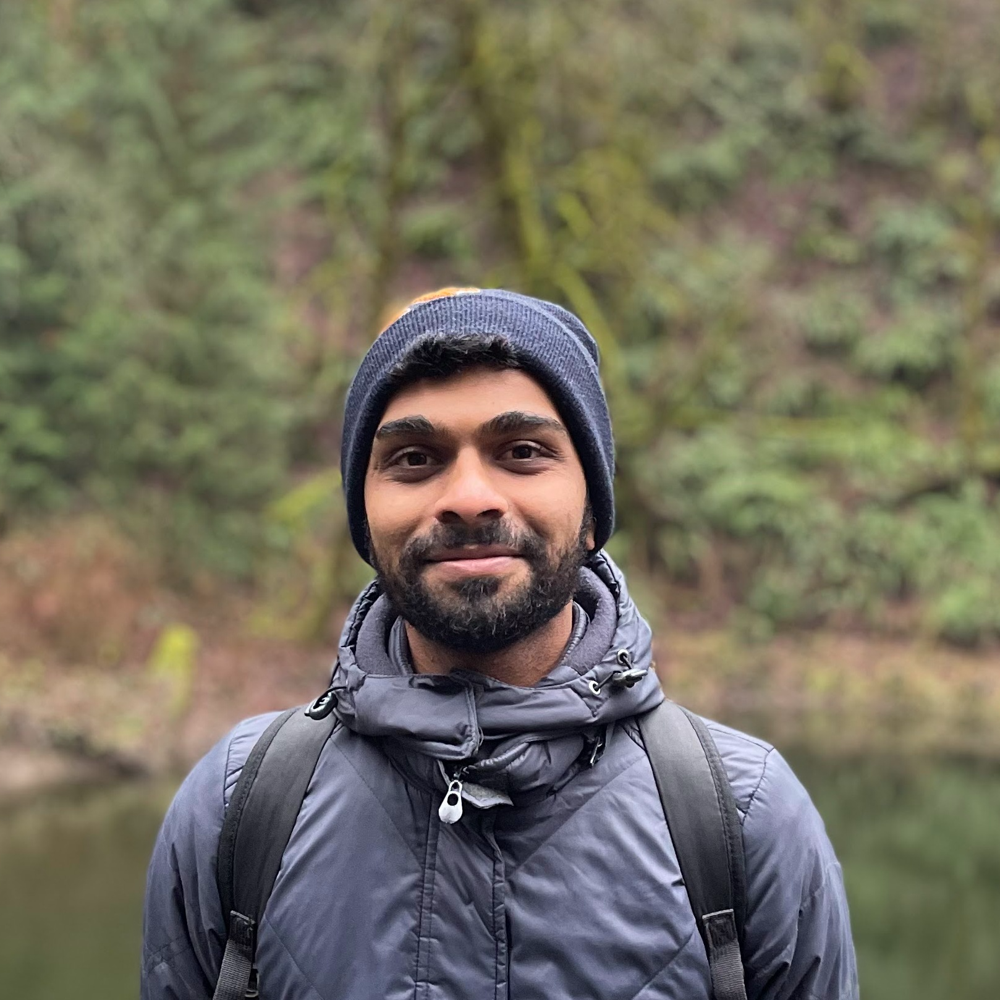

## About Me

I am a PhD student at <a href="https://www.berkeley.edu/">UC Berkeley</a> in the <a
  href="https://ps.berkeley.edu/">Programming Systems</a> group and the <a href="https://sky.cs.berkeley.edu/">Sky
  Lab</a> advised by <a href="https://people.eecs.berkeley.edu/~ksen">Koushik Sen</a>. I broadly research techniques and
design systems for expressive and reliable programming.

## Research Interest

I am interested in Programming Languages and Software Engineering, specifically, in tools for program synthesis and
analysis.
Currently, my work is motivated by abstractions for programs that simplify reasoning about code by introducing either
structure (graphs) or abstract semantics (language).
This interest naturally touches language models (LLM) and ML4Code as means to learn and enrich these abstractions.

Previously, I worked at <a href="https://www.microsoft.com/en-us/research/">Microsoft Research (MSR)</a> in the <a
  href="https://www.microsoft.com/en-us/research/theme/systems/">Programming Languages and Systems Group</a> on
developer and debugging tools for system reliability.

  *If you'd like to collaborate, drop me an email at: manishs@berkeley.edu*

## News

  

    

      

        Apr 2024. 
          🎖️ Honored to have received the <a href="https://www2.eecs.berkeley.edu/Students/Awards/12/">Tong Leong Lim
            Pre-Doctoral Prize</a> at UC Berkeley
        
      

    

    

      

        Mar 2024. 
          🏆 Honored to have received the 2024 <a
            href="https://gsi.berkeley.edu/programs-services/award-programs/ogsi/">Outstanding Graduate Student
            Instructor Award</a> at UC Berkeley
        
      

    

    

      

        Jan 2024. 
          Interning (returning) with the <a
            href="https://www.microsoft.com/en-us/research/group/systems-innovation/">Systems Innovation</a> group at
          Microsoft Research in Summer'24! Exploring next-generation AI Assisted System Reliability.
      

    

    

      

        Sept 2023. 
          ✔︎ Passed the <a href="https://eecs.berkeley.edu/resources/grads/phd/prelims/exam-prep">Programming Languages
            Preliminary Exam</a> at UC Berkeley!
      

    

    

      

        May 2023. 
          Taught my first class: <a href="https://sites.google.com/berkeley.edu/cs164sp23/home">CS164: Compilers and
            Programming Languages</a> at UC Berkeley!
      

    

    

      

        Nov 2022. 
          🏆 Our <a href="https://dl.acm.org/doi/10.1145/3542929.3563482">empirical study</a> @ Microsoft Research on
          production incidents in large-scale cloud services
          received the <a href="https://twitter.com/ACMSoCC/status/1590128032886685696?s=20"
            style="color: #D33682; font-weight: 500;">Best Paper Award 🏆</a> at <b>SoCC 2022</b>. 
      

    

    

      

        Aug 2022. 
          Started my Ph.D. at UC Berkeley advised by <a href="https://people.eecs.berkeley.edu/~ksen">Prof. Koushik
            Sen</a>. Joining the <a href="https://sky.cs.berkeley.edu/">Sky Lab</a> and the Programming Systems
          group!
      

    

  

## Publications

**R2E: Turning any GitHub Repository into a Programming Agent Test Environment**  
Manish Shetty*, Naman Jain*, Tianjun Zhang, King Han, Koushik Sen, Ion
  Stoica 
  **LLMAgents Workshop @ ICLR 2024**.   
<a href="">paper (available on request)</a>
<!-- <a href="">code</a> / -->
<!-- <a href="">blog</a> -->

**DSPy Assertions: Computational Constraints for Self-Refining LM Pipelines**  
Arnav Singhvi*, Manish Shetty*, Shangyin Tan*, Chris Potts,
  Koushik Sen, Matei Zaharia, Omar Khattab 
  Under Submission, 2023.   
<a href="https://arxiv.org/abs/2312.13382">paper</a> /
<a href="https://github.com/stanfordnlp/dspy/blob/main/dspy/primitives/assertions.py">code</a> /
<a href="https://twitter.com/lateinteraction/status/1735326551393161563">tweet-1</a> /
<a href="https://twitter.com/lateinteraction/status/1755337965751198042">tweet-2</a> /
<a href="/blog/scrivings/dspy-assertions-a-pr-reviews-pov/">blog</a>

**CodeScholar: Growing Idiomatic Code Examples**  
Manish Shetty, Koushik Sen, Ion Stoica  
  arXiv, 2023   
<a href="https://arxiv.org/abs/2312.15157">paper</a> /
<a href="https://github.com/tart-proj/codescholar">code</a>

<!-- **Large-scale Performance Characterization of Distributed Graph Processing Frameworks**  
Altan Haan*, Manish Shetty* 
technical report, 2023   
<a href="/pdf/preprints/graph-study.pdf">paper</a> -->
<!-- <a href="">code</a> / -->
<!-- <a href="">blog</a> -->

**How to Fight Production Incidents? An Empirical Study on a Large-scale Cloud Service**  
Supriyo Ghosh, Manish Shetty, Chetan Bansal, Suman Nath  
  **SoCC 2022**: Proceedings of the 13th Symposium on Cloud Computing   
<a href="https://dl.acm.org/doi/10.1145/3542929.3563482">paper</a> / <a
  href="https://twitter.com/ACMSoCC/status/1590128032886685696?s=20" style="color: #D33682; font-weight: 500;">Best
  Paper Award 🏆</a>

**AutoTSG: Learning and Synthesis for Incident Troubleshooting**  
Manish Shetty, Chetan Bansal, Sai Upadhyayula, Arjun Radhakrishna, Anurag Gupta  
  **FSE 2022**: Proceedings of the 30th ACM Symposium on the Foundations of Software Engineering   
<a href="https://arxiv.org/pdf/2205.13457.pdf">paper</a>

**DeepAnalyze: Learning to Localize Crashes at Scale**  
Manish Shetty, Chetan Bansal, Suman Nath, Sean Bowles, Henry Wang, Ozgur Arman, Siamak Ahari
   
  **ICSE 2022**: Proceedings of the 44th International Conference on Software Engineering   
<a href="https://arxiv.org/pdf/2109.14326.pdf">paper</a> /
<a href="/pdf/slides/DeepAnalyze_ICSE_2022.pdf">slides</a> /
<a href="https://youtu.be/UqwcSTiIP_I">talk-1</a> /
<a href="https://youtu.be/aFZni_d-Sc0">talk-2</a> /
<a href="https://youtu.be/bT5B30qAaW0">talk-3</a>

**Neural Knowledge Extraction From Cloud Service Incidents**  
 Manish Shetty, Chetan Bansal, Sumit Kumar, Nikitha Rao, Nachiappan Nagappan, Thomas
  Zimmermann  
  **ICSE 2021**: Proceedings of the 43rd International Conference on Software Engineering   
<a href="https://arxiv.org/abs/2007.05505">paper</a> /
<a href="pdf/slides/SoftNER_ICSE_2021.pdf">slides</a> /
<a href="https://youtu.be/nObO7Q9NlcA">talk</a> /
<a href="https://venturebeat.com/2020/07/14/microsofts-softner-ai-uses-unsupervised-learning-to-help-triage-cloud-service-outages/"
  style="color: #D33682; font-weight: 500;"> featured on <b>VentureBeat</b> </a>
<!-- <a href="" style="color: #D33682;">Distinguished paper award nomination </a> -->

## Teaching

UC Berkeley:
* Spring 2023 CS164: Programming Languages and Compilers (Head TA with [Koushik
Sen](https://people.eecs.berkeley.edu/~ksen/))  
<a href="https://sites.google.com/berkeley.edu/cs164sp23/home">website</a> / <a
  href="./pdf/courses/cs164sp23-course-evals.pdf">course evaluations</a>

## Service

<aside markdown="1">
  * 2024: PLDI (Sub-reviewer); PLDI (Artifact Evaluation)
  * 2023: ISSTA (Sub-reviewer)
  * 2022: ICLR (Reviewer); MSR (Shadow PC)
  * 2021: MSR (Shadow PC)
</aside>

## Projects



  

